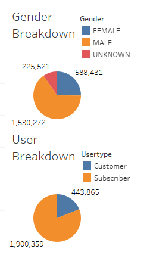
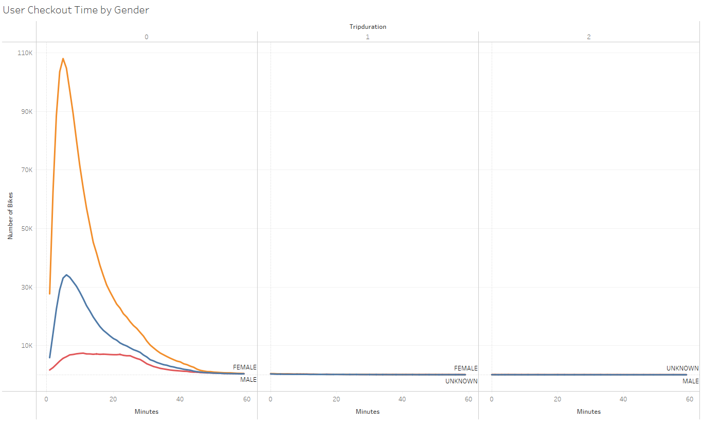

# bikesharing
Using CitiBike data to visualize the feasibility of a similar bike sharing program in Des Moines, Iowa.

[NYC_Bike_Challenge__Tableua_Story](https://public.tableau.com/app/profile/pablo.azcona/viz/Citibike_Challenge_16491674258500/NYCCitiBikeChallenge?publish=yes)

# Overview of the statistical analysis:

The purpose of the analysis is to create a visualization via Tabeleau to assess the viability of a bike sharing system in Des Moines, Iowa. This involves importing data into Tableau and then creating various style worksheets, dashboards, and a story. The program is built to publish and display data in a professional manner. The data is accurately illustrated in various dashboards that are also interactive and shareable.

# Results:

1. Average Trip Duration Based on Birth Year

- There were over 2.3 million rides for the month of August 2019.
- There is a wide range of the age of the users. Younger users tend to use the service for longer rides.

2. Top Starting Locations

- Top ride starting locations are in the most touristic and busy areas, as we see here in Manhattan.

3. Breakdown of the User Groups by Gender and Type

- 81% of the users were subscribers. 65% of the users were confirmed males and 25% were confirmed females.

4. User Checkout Time

- Bikes are primarily checked out for 4 to 6 hours.

5. User Checkout Time by Gender

- Bikes are primarily checked out for 4 to 6 hours; however, males ride approximately more by a factor of ~3.

6. Trips by Weekday

- Most weekday rides are around 7:00 AM to 9 AM and 5:00 PM to 7:00 PM which are considered the commuting hours.
- Weekend rides are highest from 10:00 AM to 7:00 PM.

7. Trips by Weekday by Gender

- That portion of rides is mostly taken by male users.

8. User Trips by Gender by Weekday

- Male subscribers tend to make more trips, especially on Thursdays. This holds true for woman subscribers. 

# Summary:

The data shows high activity of the bike sharing service in New York during the month of August 2019.
The far majority of the rides were in the very busy Manhattan Island, taken by male users during commuting hours. This indicates that CitiBike services are used as an alternative to public transportation by commuting workers.

Additional analysis could include:

- comparing data for different months to determine trends across the year
- including transportation data to find the flow of the population across different modes of transportation